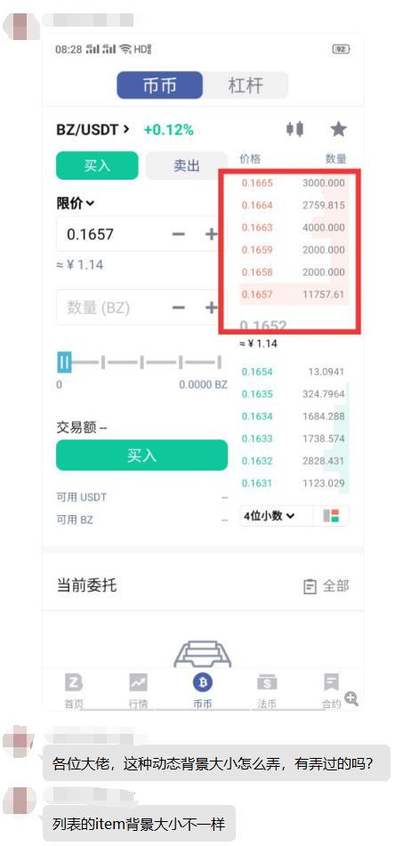

# BackgroundProgress
之所以有这个项目是因为无意中看到[玩Android9群]一位群友提了个问题：

于是我尝试用三种方式对这个效果进行实现：

1. 自定义`View`
2. `ConstraintLayout.LayoutParams#matchConstraintPercentWidth`
3. 普通`ViewGroup`获取item宽度，根据百分比算出背景进度的宽度

其实2和3都是修改`LayoutParams`

从实现的时间层面来说，肯定是`ConstraintLayout` > `普通ViewGroup，自己算宽度` > `自定义View`

而考虑性能，首选自定义View。

三种实现方式的代码在此记录。